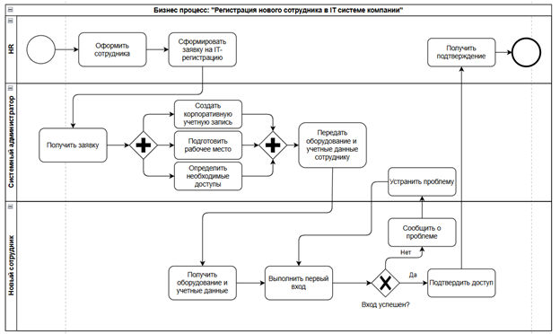

# Ответы на тестовое задание

## 1 SQL - БАЗОВЫЕ ЗНАНИЯ

### 1.1 Вопрос на знание select … join

**Вопрос**

Есть две таблицы:

```text
Т1 (ID int, Text1 …., text2 …. B и т.д.)

И

Т2 (ID int, Text1 …., text2 …. B и т.д.)
```

Написать select

1. Вывести все поля из обеих таблиц, вывести записи при условии, что ID обеих таблиц совпадают.

2. Вывести все поля из обеих таблиц, вывести все записи из T1 и только имеющиеся в T2

3. Вывести все записи из T1, при условии, что таких ID нет в T2

**Ответ**

1.

```sql
SELECT * FROM T1
INNER JOIN T2
ON T1.ID = T2.ID
```

2.

```sql
SELECT * FROM T1
LEFT JOIN T2
ON T1.ID = T2.ID
```

3.

```sql
SELECT T1.*
FROM T1
LEFT JOIN T2
    ON T1.ID = T2.ID
WHERE T2.ID IS NULL;
```

---

### 1.2 Как вывести результат запроса в XML?

**Вопрос**

Пусть есть таблица T со следующим видом и содержанием. Что вернет SQL запрос?

| Id | Code | Name | StatusId |
|---|---|---|---|
| 1 | gargadgadfga | Запрос предложений 1 | 45 |
| 2 | bsftrggdfgadfgdfat | Запрос предложений 2 | 2 |
| 3 | gfadgdfsgdfsgs | Запрос предложений 3 | 45 |
| 4 | afgereaerffdgvdf | Запрос предложений 4 | 3 |
| 5 | dgadfterdsgsdgad | Запрос предложений 5 | 45 |
| 6 | argrgag | Запрос предложений 6 | 2 |

Написать запрос, выводящий данные в XML

**Ответ**

```sql
SELECT Id, Code, Name, StatusId
FROM T
FOR XML PATH('Bid'), ROOT('Bids');
```

```xml
<Bids>
  <Bid>
    <Id>1</Id>
    <Code>gargadgadfga</Code>
    <Name>Запрос предложений 1</Name>
    <StatusId>45</StatusId>
  </Bid>
  <Bid>
    <Id>2</Id>
    <Code>bsftrggdfgadfgdfat</Code>
    <Name>Запрос предложений 2</Name>
    <StatusId>2</StatusId>
  </Bid>
  <Bid>
    <Id>3</Id>
    <Code>gfadgdfsgdfsgs</Code>
    <Name>Запрос предложений 3</Name>
    <StatusId>45</StatusId>
  </Bid>
  <Bid>
    <Id>4</Id>
    <Code>afgereaerffdgvdf</Code>
    <Name>Запрос предложений 4</Name>
    <StatusId>3</StatusId>
  </Bid>
  <Bid>
    <Id>5</Id>
    <Code>dgadfterdsgsdgad</Code>
    <Name>Запрос предложений 5</Name>
    <StatusId>45</StatusId>
  </Bid>
  <Bid>
    <Id>6</Id>
    <Code>argrgag</Code>
    <Name>Запрос предложений 6</Name>
    <StatusId>2</StatusId>
  </Bid>
</Bids>
```

---

### 1.3 Как выбрать данные из поля с XML?

**Вопрос**

Написать запрос, выбирающий данные из XML из предыдущего вопроса

Отфильтровать данные по StatusId != 3

**Ответ**

```sql
DECLARE @Xml XML = N'
<Bids>
  <Bid>
    <Id>1</Id>
    <Code>gargadgadfga</Code>
    <Name>Запрос предложений 1</Name>
    <StatusId>45</StatusId>
  </Bid>
  <Bid>
    <Id>2</Id>
    <Code>bsftrggdfgadfgdfat</Code>
    <Name>Запрос предложений 2</Name>
    <StatusId>2</StatusId>
  </Bid>
  <Bid>
    <Id>3</Id>
    <Code>gfadgdfsgdfsgs</Code>
    <Name>Запрос предложений 3</Name>
    <StatusId>45</StatusId>
  </Bid>
  <Bid>
    <Id>4</Id>
    <Code>afgereaerffdgvdf</Code>
    <Name>Запрос предложений 4</Name>
    <StatusId>3</StatusId>
  </Bid>
  <Bid>
    <Id>5</Id>
    <Code>dgadfterdsgsdgad</Code>
    <Name>Запрос предложений 5</Name>
    <StatusId>45</StatusId>
  </Bid>
  <Bid>
    <Id>6</Id>
    <Code>argrgag</Code>
    <Name>Запрос предложений 6</Name>
    <StatusId>2</StatusId>
  </Bid>
</Bids>';

SELECT
    B.value('(Id)[1]', 'INT') AS Id,
    B.value('(Code)[1]', 'NVARCHAR(100)') AS Code,
    B.value('(Name)[1]', 'NVARCHAR(200)') AS Name,
    B.value('(StatusId)[1]', 'INT') AS StatusId
FROM @Xml.nodes('/Bids/Bid') AS X(B)
WHERE B.value('(StatusId)[1]', 'INT') <> 3;
```

---

### 1.4 Что такое hints

**Вопрос**

Что такое hints

**Ответ**

Hints — это подсказки SQL Server, которые позволяют повлиять на то, как будет выполняться запрос.

Например, с их помощью можно указать:

какой индекс использовать;
как работать с блокировками;
нужно ли пересобрать план выполнения.

Примеры:
```sql
SELECT *
FROM Bid WITH (NOLOCK);
```
NOLOCK позволяет читать данные без ожидания обычных блокировок.
```sql
SELECT *
FROM Bid
WHERE StatusId = 45
OPTION (RECOMPILE);
```
RECOMPILE заставляет SQL Server заново строить план выполнения запроса.

Hints используют осторожно, потому что неудачная подсказка может ухудшить производительность.
---

### 1.5 Какие виды блокировок существуют?

**Вопрос**

Какие виды блокировок существуют?

**Ответ**

Основные блокировки SQL Server:

Shared (S) — используется при чтении.
```sql
SELECT *
FROM Books
WHERE Id = 1;
```
Несколько транзакций могут одновременно читать строку, но изменить её в этот момент нельзя.
Exclusive (X) — используется при изменении данных.
```sql
UPDATE Books
SET Title = 'Новое название'
WHERE Id = 1;
```
Пока транзакция изменяет строку, другая транзакция не сможет получить несовместимую блокировку на эти данные.
Update (U) — используется перед изменением данных, когда строка сначала читается, а затем обновляется.
```sql
SELECT *
FROM Books WITH (UPDLOCK)
WHERE Id = 1;
```
Такая блокировка показывает, что транзакция собирается изменить строку, и помогает избежать конфликтов между несколькими обновлениями.
---

### 1.6 Что такое транзакция?

**Вопрос**

Что такое транзакция?

**Ответ**

Транзакция — это группа операций с БД, которая рассматривается как единая операция: либо все изменения успешно фиксируются, либо при ошибке откатываются. Основные свойства транзакций описываются принципами ACID.

- Atomicity — либо выполняются все операции, либо ни одна.
- Consistency — данные переходят из одного корректного состояния в другое.
- Isolation — параллельные транзакции не должны некорректно влиять друг на друга.
- Durability — после COMMIT изменения сохраняются даже при сбое.

---

### 1.7 Чем delete … от truncate … отличается?

**Вопрос**

Чем delete … от truncate … отличается?

**Ответ**

DELETE — построчное удаление данных, поддерживает WHERE. TRUNCATE — быстрая очистка всей таблицы без WHERE; в SQL Server дополнительно сбрасывает счётчик IDENTITY.

---

## 2 SQL – ПРАКТИЧЕСКИЕ ЗАДАЧИ

### 2.1 Напишите хранимую процедуру

**Вопрос**

Постановка задачи

```text
/*
Есть база данных в банке. В базе данных есть таблица со счетами (назовем её для простоты T). В таблице T есть среди прочих поля:

N - Номер счета
S - сумма на счете

Требуется:

Написать хранимую процедуру на языке SQL, которая:

1. Принимает в качестве аргументов параметры:
    @N1 - номер первого счета
    @N2 - номер второго счета
    @S - сумма денежных средств

2. Переводит сумму @S с первого на второй счет, при это проверяя, достаточно ли средств на первом счете

3. Использует транзакцию при переводе с первого на второй счет (показать, как работают транзакции).
```

**Ответ**

```sql
CREATE PROCEDURE TransferMoney
    @N1 INT,
    @N2 INT,
    @S DECIMAL(18, 2)
AS
BEGIN
    SET NOCOUNT ON;

    BEGIN TRY
        BEGIN TRANSACTION;

        IF @S <= 0
            THROW 50001, N'Сумма перевода должна быть больше нуля.', 1;

        IF NOT EXISTS (
            SELECT 1
            FROM T
            WHERE N = @N2
        )
            THROW 50002, N'Счёт получателя не найден.', 1;

        UPDATE T
        SET S = S - @S
        WHERE N = @N1
          AND S >= @S;

        IF @@ROWCOUNT = 0
            THROW 50003, N'Счёт отправителя не найден или недостаточно средств.', 1;

        UPDATE T
        SET S = S + @S
        WHERE N = @N2;

        COMMIT TRANSACTION;
    END TRY
    BEGIN CATCH
        IF @@TRANCOUNT > 0
            ROLLBACK TRANSACTION;

        THROW;
    END CATCH;
END;
```

---

### 2.2 Задача на вывод в XML.

**Вопрос**

Пусть есть таблица Purchase со следующим видом и содержанием. Что вернет SQL запрос?

| Id | Code | Name | StatusId |
|---|---|---|---|
| 1 | SBR003-202001 | Конкурс СМСП | 45 |
| 2 | SBR003-202002 | Запрос предложений | 2 |

```sql
SELECT Id, Code, Name, StatusId FROM Purchase FOR XML path('row'), ROOT('data')
```

**Ответ**

```xml
<data>
  <row>
    <Id>1</Id>
    <Code>SBR003-202001</Code>
    <Name>Конкурс СМСП</Name>
    <StatusId>45</StatusId>
  </row>
  <row>
    <Id>2</Id>
    <Code>SBR003-202002</Code>
    <Name>Запрос предложений</Name>
    <StatusId>2</StatusId>
  </row>
</data>
```

---

### 2.3 Задача на диагностику проблемы.

**Вопрос**

Есть автоматическое задание (task), которое выполняется каждую минуту. Таск регистрирует электронный документ «Результаты торгов». При регистрации документа возможно изменить атрибуты записи в БД. Таск также определяется SQL запросом, который, собственно, и выбирает лоты, по которым надо сформировать этот документ. Вот пример этого SQL:

```sql
SELECT Bid.Id, Purchase.OrgBuId, Purchase.TypeId
FROM Bid JOIN Purchase ON Purchase.Id = Bid.PurchaseId
WHERE Bid.StatusId = 6
```

Ситуация: вечером был перенос этого таска с тестового на боевой сервер. На следующий день вы приходите с утра и видите, что по всем подходящим лотам всю ночь каждую минуту формировался этот документ.

Вопрос: почему так произошло и что надо исправить?

**Ответ**

Так произошло, потому что запрос каждый раз берет все подходящие записи с Bid.StatusId = 6. На тестовом сервере либо не было подходящих данных, которые могли привести к такой ситуации, либо на тестовом сервере был ещё функционал изменения атрибута StatusId (может быть он включается настройкой), и его забыли перенести (или включить настройку).

Варианты что можно сделать:

1. Менять статус после обработки, например, Bid.StatusId = 6 -> Bid.StatusId = 7

2. Добавить новое поле в базе, например, Bid.IsDocumentCreated и изменить запрос, и при создании документа менять Bid.IsDocumentCreated

```sql
SELECT Bid.Id, Purchase.OrgBuId, Purchase.TypeId
FROM Bid JOIN Purchase ON Purchase.Id = Bid.PurchaseId
WHERE Bid.StatusId = 6 AND Bid.IsDocumentCreated = 0
```

3. Можно проверять существование самого документа и выбирать только лоты, для которых результаты торгов ещё не созданы.

---

## 3 Понимание базовых концепций програмирования

### 3.1 Задача на валидность XML

**Вопрос**

Перед вами пример XML файла, но он не пройдет валидацию. Найдите все ошибки.

```xml
<PurchaseInfo>
    <PurchaseId>7380554</PurchaseId>
    <PurchaseCode>SBR031-1910280001</PurchaseCode>
    <PurchaseName>Конкурс с ценой < 500 000 руб.</PurchaseName>
    <TypeInfo><TypeName>Конкурс</TypeInfo></TypeName>
</Purchaseinfo>
<BidInfo>
    <BidId>652245</BidId>
    <BidName>Право на заключение договора</BidName>
    <BidNo>1</BidNo>
    <BidPrice>2000000.00</BidPrice>
    <BidCurrency>Российский рубль
    <BidCurrencyName>57287</BidCurrencyName>
</BidInfo>
<RequestInfo>
    <BuId AccessByOrganization=1>20535</BuId>
    <RequestBuName>ИП Анар Ростовский</RequestBuName>
    <RequestCreateDate>28.10.2019 17:42</RequestCreateDate>
    <RequestId>157545</RequestId>
    <RequestINN>100000000004</RequestINN>
    <RequestNo>2<RequestNo>
</RequestInfo>
```

**Ответ**

1.  Нет корня;

2.  «Конкурс с ценой < 500 000 руб. Символ < будет ошибкой, так как считается началом тэга, необходимо заменить на &lt;

3. <PurchaseInfo> </Purchaseinfo> Не совпадает регистр буквы i, xml-регистрозависимый;

4. <TypeInfo><TypeName>Конкурс</TypeInfo></TypeName> Закрывающие тэги перепутаны местами;

5. <BidCurrency> Нет закрывающего тэга

6. BuId AccessByOrganization=1 Значение атрибута без кавычек AccessByOrganization="1"

7. <RequestNo>2<RequestNo> нет слэша у закрывающего тэга

---

### 3.2 Поиск дублей в массиве

**Вопрос**

Дано:

Есть массив M с типом int32, в массиве N элементов. N – очень много.

Есть комп. с неограниченным объемом памяти. Память можно использовать любым образом.

Вопрос:

Циклом за один проход по массиву определить имеются ли в нем повторяющиеся элементы

Написать алгоритм или рассказать идею, как решить

**Ответ**

```csharp
static bool HasDuplicates(int[] M)
{
    var seenElements = new HashSet<int>();

    foreach (var number in M)
    {
        if (seenElements.Contains(number))
        {
            return true;
        }
        seenElements.Add(number);
    }

    return false;
}
```

---

### 3.3 Опциональное задание (его выполнение будет Вашим большим преимуществом)

1. Установить MS SQL Express Edition

2. Cоздать БД . Например список книг в домашней библиотеке: Название, автор, год издания, … другие поля, оглавление в виде xml поля. Оглавление в виде xml файла.

3. Создать хранимые процедуры для  insert, update, delete, select …

4. Создать 2 типа проектов в MS Visual Studio: MVC, WEB-Forms

5. Для каждого реализовать карточку, список, функции редактирования, создания, изменения, просмотра записей с помощью хранимых процедур.

6. Также в карточке сделать форму для редактирования оглавления в виде HTML редактора (можно найти контрол в интернете), сохранять содержимое в xml поле.

7. Реализовать примеры выборки данных из xml.

> Выполнение опционального задания описано в [README.md](README.md).

---

## 4 ИНЖЕНЕРИЯ И ОБРАБОТКА ИНФОРМАЦИИ

### 4.1 Экономика:

**Вопрос**

Есть 2 формы налогообложения:

Налог платится в размере 6% налогов от доходов

Налог платится в размере 15% от разницы (доходы – расходы)

Вопрос: при каком уровне расходов (в % от доходов) эти две системы эквивалентны по выплате налогов

**Ответ**

```text
0,06x = 0,15(x-y), x = 1 = 100%
0,06 = 0,15(1-y)
0,15y = 0,09
Y = 0,6 = 60%
```
При уровне расходов 60% эти две системы эквивалентны по выплате налогов.
---

### 4.2 Инженерная задача

**Вопрос**

Есть 2 столба, между ними висит провод длиной 184,2 метра

От нижней точки висящего провода до земли 7,9 метра

Высота столбов 100 метров

Вопрос:

Каково расстояние между столбами?

**Ответ**

В данном случае провод опускается на 100-7,9 = 92,1 метра от столба, что составляет половину длины провода, а так как провод закреплен на двух столбах, обе его половины должны свисать строго вертикально вниз, чтобы достичь этой точки, соответственно расстояние между ними = 0.

В общем виде задача решается через гиперболический арксинус

1. s – длина половины провода, f – высота столба – высота земли

2. геометрия изгиба a = (s^2 – f^2)/(2*f)

3. Расстояние между столбами x = 2 * a * asinh(s/a)

В данном случае a будет равно 0, что означает что означает что линия вертикальна, то есть расстояние между столбами равно 0.

---

### 4.3 Задачи на поиск и структурирование информации

#### 4.3.1 Как устроена система государственных закупок в Российской федерации?

**Вопрос**

Как устроена система государственных закупок в Российской федерации?

**Ответ**

Система государственных закупок в России — это регулируемый процесс приобретения товаров, работ и услуг для государственных и муниципальных нужд. Она базируется на двух главных законах: ФЗ-44 (обеспечение государственных и муниципальных нужд) и ФЗ-223 (закупки отдельными видами юридических лиц, например, госкомпаниями).

Участники системы

- Заказчики: государственные органы, казенные и бюджетные учреждения, госкомпании.
- Поставщики: юридические лица, индивидуальные предприниматели или физические лица, которые предлагают товары или услуги.
- Контрольные органы: Федеральная антимонопольная служба (ФАС), Казначейство, Счетная палата.
- Операторы площадок: специальные электронные платформы для проведения торгов.

Основные этапы закупки

- Планирование: заказчик создает план-график закупок на год.
- Извещение: публикация информации о закупке на официальном ресурсе.
- Подача заявок: участники предлагают свои цены и условия.
- Торги и выбор победителя: определение поставщика, предложившего лучшие условия или наименьшую цену.
- Заключение контракта: подписание договора между заказчиком и победителем.

Главные площадки и ресурсы

- ЕИС (Единая информационная система): главный портал, где публикуются все данные о закупках, планах и отчетах.
- Электронные площадки: аккредитованные сайты (например, Сбербанк-АСТ, РТС-тендер), на которых проходят сами торги.

---

#### 4.3.2 Что регулирует 44 ФЗ?

**Вопрос**

Что регулирует 44 ФЗ?

**Ответ**

Федеральный закон № 44-ФЗ «О контрактной системе в сфере закупок товаров, работ, услуг для обеспечения государственных и муниципальных нужд» регулирует отношения, направленные на обеспечение государственных и муниципальных нужд.

Согласно статье 1 указанного закона, регулированию подлежат следующие направления:

- Планирование закупок товаров, работ, услуг.
- Определение поставщиков (подрядчиков, исполнителей).
- Заключение государственных и муниципальных контрактов.
- Особенности исполнения контрактов и приемки результатов.
- Аудит результатов закупок и контроль за соблюдением законодательства.

---

#### 4.3.3 Что регулирует 223 ФЗ?

**Вопрос**

Что регулирует 223 ФЗ?

**Ответ**

Федеральный закон № 223-ФЗ «О закупках товаров, работ, услуг отдельными видами юридических лиц» регулирует общие принципы и порядок закупок организаций с государственным участием, естественных монополий и компаний, работающих в регулируемых сферах.

К таким заказчикам относятся, например:

государственные корпорации и государственные компании;
субъекты естественных монополий;
организации в сферах электроснабжения, газоснабжения и водоснабжения;
общества, в которых доля государства или муниципального образования превышает 50%;
их дочерние общества;
бюджетные учреждения при отдельных видах закупок.

В отличие от 44-ФЗ, закон № 223-ФЗ не устанавливает единый жёсткий порядок проведения всех закупок. Заказчик разрабатывает собственное Положение о закупке, в котором определяет применяемые способы закупок, порядок их проведения и другие правила.

Основная информация о закупочной деятельности и Положение о закупке размещаются в ЕИС.
---

#### 4.3.4 Что такое «B to B»?

**Вопрос**

Что такое «B to B»?

**Ответ**

B to B (Business-to-Business) — это модель коммерческого взаимодействия, при которой одна компания продает товары, работы или услуги другим компаниям для обеспечения их деятельности.

---

#### 4.3.5 Привести пример бизнеса процесса, нарисовать схему бизнес-процесса.

**Вопрос**

Привести пример бизнеса процесса, нарисовать схему бизнес-процесса.

**Ответ**



- HR оформляет нового сотрудника.
- HR формирует заявку на регистрацию сотрудника в IT-системе.
- Системный администратор получает заявку.
- Параллельно выполняются три действия:
  - создаётся корпоративная учётная запись;
  - подготавливается рабочее место;
  - определяются необходимые доступы.
- После завершения всех действий администратор передаёт сотруднику оборудование и учётные данные.
- Новый сотрудник выполняет первый вход в систему.
- Если вход успешен — сотрудник подтверждает доступ, HR получает подтверждение, процесс завершается.
- Если вход неуспешен — сотрудник сообщает о проблеме, администратор её устраняет, после чего вход выполняется повторно.
