# Тестовое задание 4A Consulting

В репозитории представлены:

- ответы на теоретические и практические вопросы тестового задания;
- выполненное опциональное задание — приложение **«Домашняя библиотека»**;
- две реализации веб-интерфейса:
  - **ASP.NET Core MVC**;
  - **ASP.NET Web Forms**;
- SQL-скрипт для развёртывания базы данных.

## Ответы на вопросы

Все ответы на основную часть тестового задания вынесены в отдельный файл:

### [Открыть ANSWERS.md](ANSWERS.md)

В нём сохранена структура исходного задания:

- SQL — базовые знания;
- SQL — практические задачи;
- базовые концепции программирования;
- инженерия и обработка информации.

---

# Опциональное задание — «Домашняя библиотека»

Реализовано приложение для ведения списка книг домашней библиотеки.

Одна база данных используется двумя веб-приложениями:

## Используемые технологии

- C#
- ASP.NET Core MVC
- ASP.NET Web Forms
- SQL Server Express
- Dapper
- Stored Procedures
- XML / XQuery
- TinyMCE
- Bootstrap

---

# Функциональность

Обе версии приложения реализуют одинаковый базовый CRUD для книг:

- просмотр списка книг;
- просмотр карточки книги;
- добавление новой книги;
- редактирование книги;
- удаление книги;
- хранение оглавления в XML-поле;
- редактирование оглавления через HTML/WYSIWYG-редактор;
- поиск книг по содержимому XML-оглавления;
- выборку данных из XML средствами SQL Server.

## Модель книги

Для книги хранятся следующие данные:

- название;
- автор;
- год издания;
- издательство;
- ISBN;
- описание;
- оглавление.

Оглавление хранится в SQL Server в поле типа `XML`.

Пример:

```xml
<contents>
  <ul>
    <li>ГЛАВА 1: Описание</li>
    <li>ГЛАВА 2: Описание</li>
  </ul>
</contents>
```

---

# Работа с XML

В приложении используются XML/XQuery-возможности SQL Server.

### `.value()`

Используется для извлечения одного значения из XML, например первого пункта оглавления.

```sql
Contents.value(
    '(/contents/ul/li/text())[1]',
    'NVARCHAR(500)'
) AS FirstContentItem
```

Первый пункт оглавления отображается непосредственно в общем списке книг.

### `.exist()`

Используется для поиска книг по содержимому оглавления.

```sql
WHERE Contents.exist(
    '/contents//li[contains(., sql:variable("@SearchText"))]'
) = 1
```

Поиск является регистрозависимым на уровне используемого XQuery.

### `.nodes()`

Используется для получения отдельных пунктов оглавления.

```sql
CROSS APPLY b.Contents.nodes('/contents//li') AS x(Item)
```

Пункты XML выводятся в карточке книги отдельными строками.

---

# Доступ к данным

Обе реализации работают с SQL Server через **Dapper**.

CRUD выполняется через хранимые процедуры:

```text
Book_Select
Book_GetById
Book_Insert
Book_Update
Book_Delete
Book_SearchByContents
Book_GetContents
```

Общая схема обращения к данным:

```text
UI
 ↓
Repository
 ↓
Dapper
 ↓
Stored Procedure
 ↓
SQL Server
```

---

# ASP.NET Core MVC

MVC-версия реализует работу с книгами через контроллеры и Razor Views.

## Реализовано

- список книг;
- карточка книги;
- создание;
- изменение;
- удаление;
- поиск по XML-оглавлению;
- вывод первого пункта оглавления;
- вывод полного оглавления;
- TinyMCE для редактирования оглавления.

## Скриншоты MVC

> Скриншоты необходимо сохранить в папку `images`.

### Список книг

Показывает таблицу книг, первый пункт XML-оглавления, поиск и CRUD-действия.

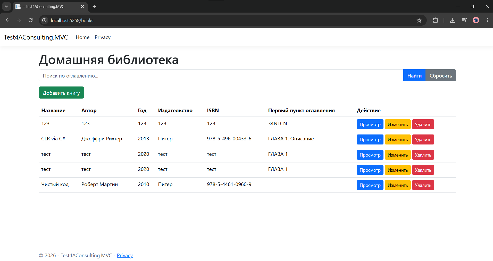

### Создание книги

Форма добавления книги с HTML-редактором оглавления.

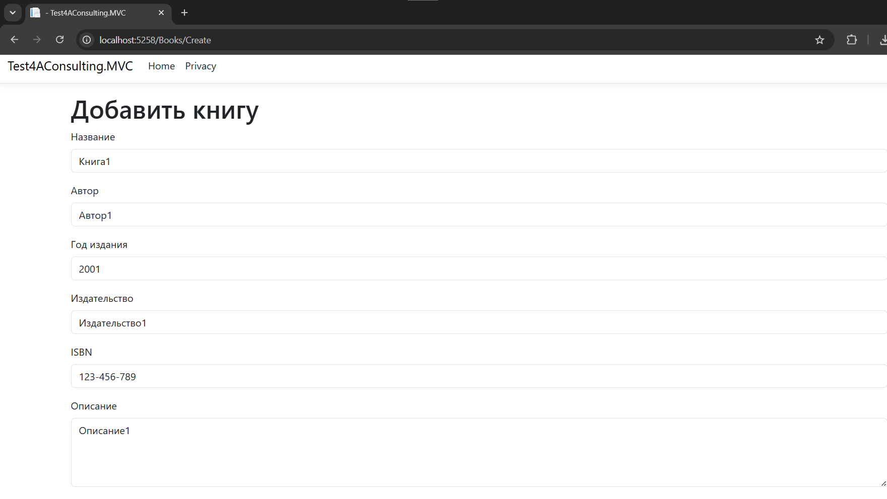
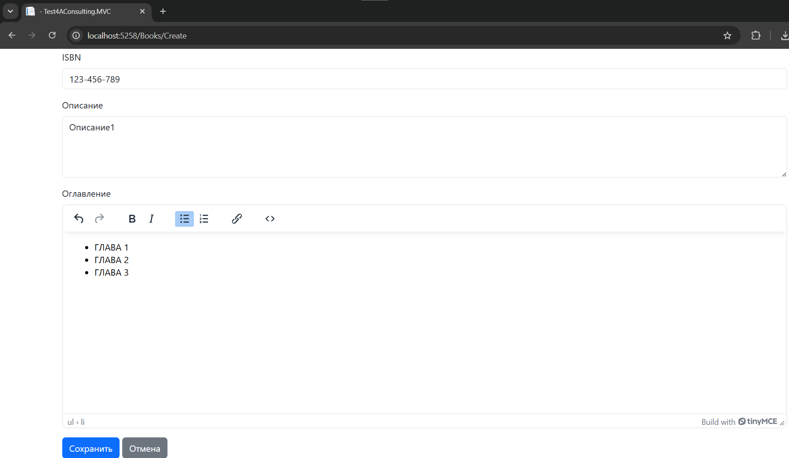

### Карточка книги

Карточка с основной информацией и оглавлением, разобранным из XML.

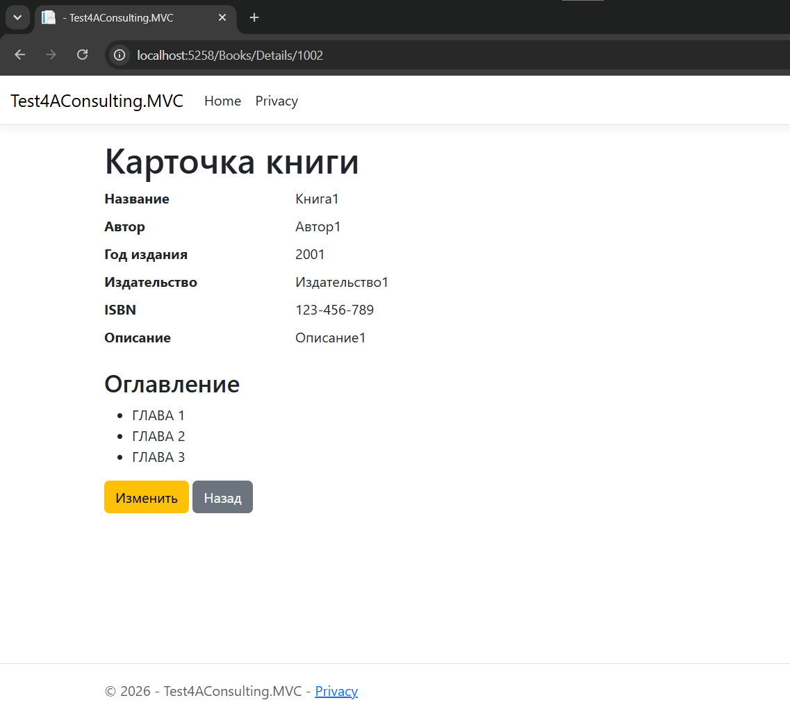

### Редактирование книги

Форма изменения существующей записи.

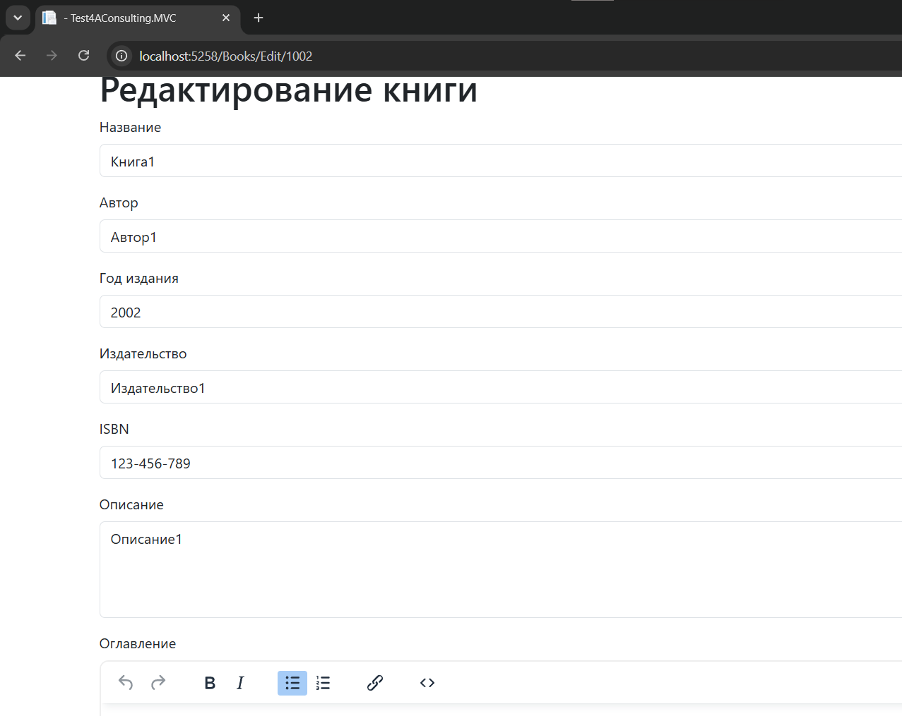

### Поиск по оглавлению

Пример поиска книги по содержимому XML через `.exist()`.

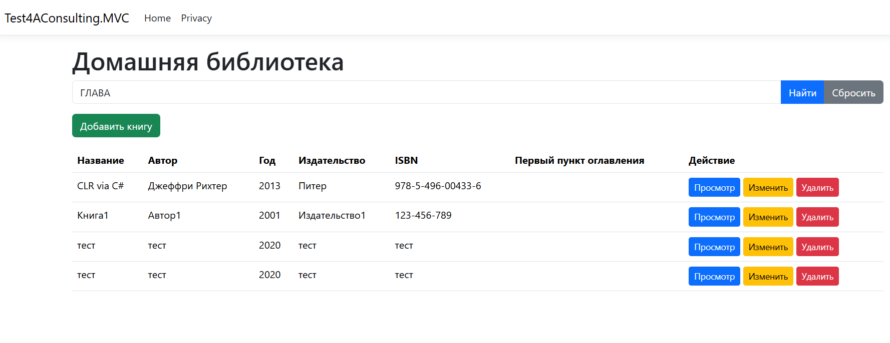

---

# ASP.NET Web Forms

Web Forms-версия реализует тот же функционал на классическом ASP.NET Web Forms.

Основные страницы приложения:

```text
Books.aspx
BookDetails.aspx
BookCreate.aspx
BookEdit.aspx
BookDelete.aspx
```

## Реализовано

- вывод списка через `GridView`;
- просмотр карточки книги;
- создание;
- изменение;
- удаление с отдельной страницей подтверждения;
- поиск по XML;
- вывод оглавления;
- TinyMCE;
- асинхронные операции через `PageAsyncTask`.

## Скриншоты Web Forms

### Список книг

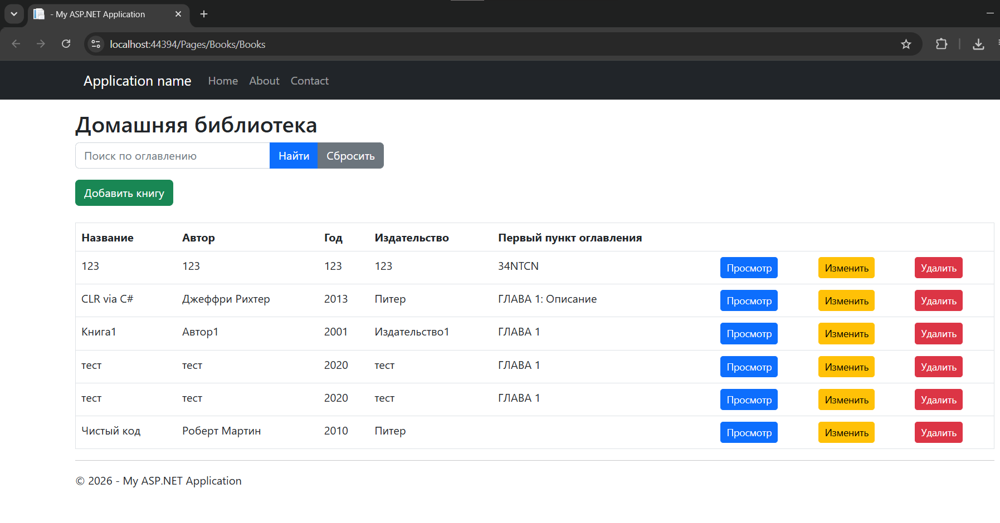

### Создание книги

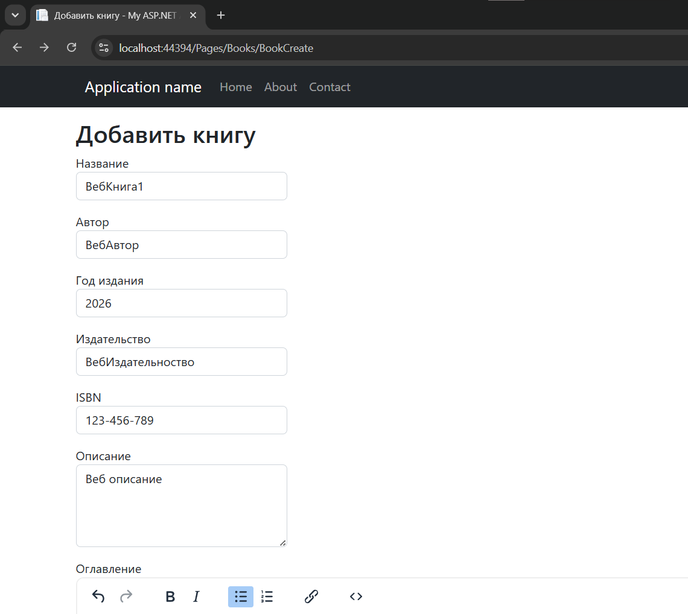
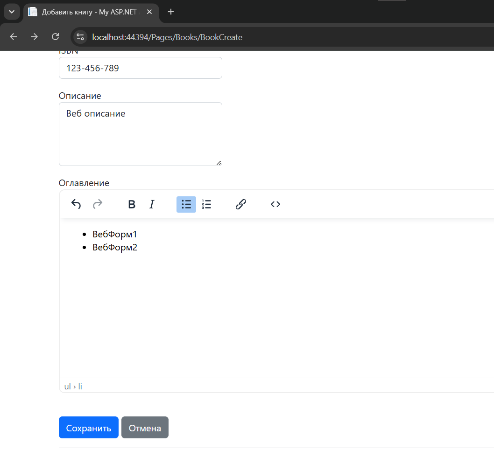

### Карточка книги

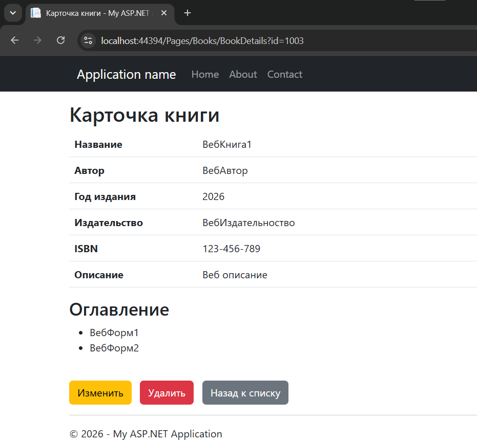

### Редактирование книги

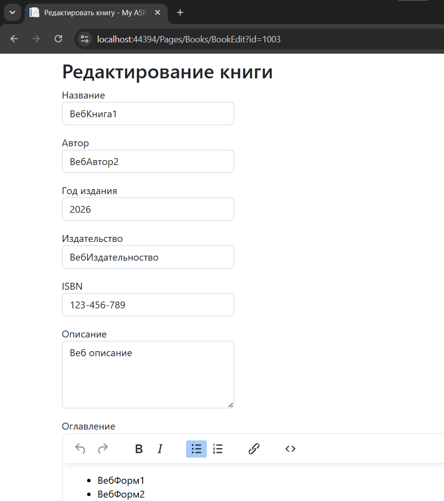

### Удаление книги

Страница подтверждения удаления записи.

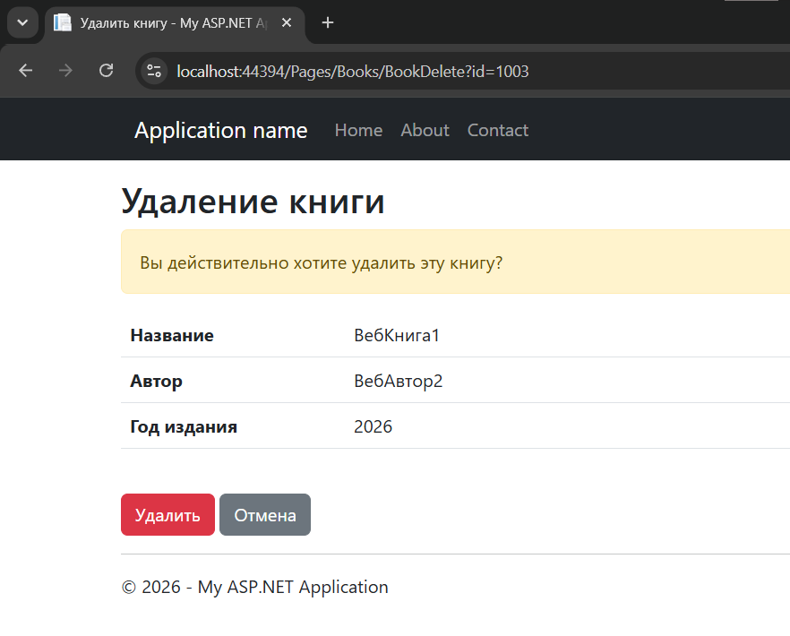

### Поиск по оглавлению

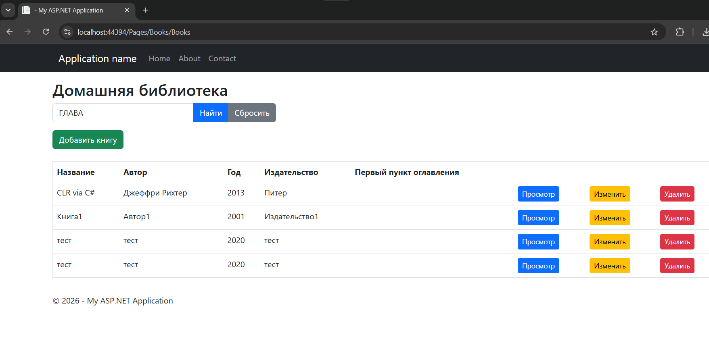

---

# База данных

В репозитории находится SQL-скрипт для развёртывания базы данных:

```text
database/database.sql
```

Скрипт предназначен для создания необходимых объектов SQL Server, включая таблицу книг и хранимые процедуры.

Основная таблица:

```text
Books
```

Ключевое для задания поле:

```sql
Contents XML NULL
```

---

# Как запустить проект

## 1. Установить необходимое ПО

Для запуска потребуется:

- Visual Studio;
- SQL Server Express;
- .NET SDK для ASP.NET Core MVC;
- .NET Framework для ASP.NET Web Forms.

SQL Server Management Studio необязателен, но удобен для выполнения SQL-скрипта и просмотра базы.

## 2. Создать базу данных

Откройте файл:

```text
database/database.sql
```

и выполните его в SQL Server.

После выполнения должна быть создана база:

```text
HomeLibraryDb
```

## 3. Проверить SQL Server instance

По умолчанию проект рассчитан на локальный SQL Server Express:

```text
.\SQLEXPRESS
```

Если экземпляр SQL Server называется иначе, необходимо изменить строку подключения.

## 4. Настроить строку подключения MVC

Строка подключения находится в `appsettings.json`.

Пример:

```json
{
  "ConnectionStrings": {
    "DefaultConnection": "Server=.\\SQLEXPRESS;Database=HomeLibraryDb;Trusted_Connection=True;TrustServerCertificate=True;"
  }
}
```

## 5. Настроить строку подключения Web Forms

Строка подключения находится в `Web.config`.

Пример:

```xml
<connectionStrings>
  <add name="DefaultConnection"
       connectionString="Server=.\SQLEXPRESS;Database=HomeLibraryDb;Trusted_Connection=True;"
       providerName="System.Data.SqlClient" />
</connectionStrings>
```

## 6. Запустить приложение

Откройте solution в Visual Studio.

Можно запустить отдельно:

- ASP.NET Core MVC-проект;
- ASP.NET Web Forms-проект.

Обе версии используют одну и ту же базу `HomeLibraryDb`.

---

# Что проверить после запуска

Для быстрой проверки функциональности:

1. открыть список книг;
2. добавить новую книгу;
3. заполнить оглавление через TinyMCE;
4. сохранить запись;
5. открыть карточку книги;
6. изменить книгу;
7. выполнить поиск по слову из оглавления;
8. удалить тестовую запись.

---

# Структура репозитория

Примерно:

```text
.
├── ANSWERS.md
├── README.md
│
├── database/
│   └── database.sql
│
├── images/
│   ├── mvc-books-list.png
│   ├── mvc-book-create.png
│   ├── mvc-book-details.png
│   ├── mvc-book-edit.png
│   ├── mvc-xml-search.png
│   ├── webforms-books-list.png
│   ├── webforms-book-create.png
│   ├── webforms-book-details.png
│   ├── webforms-book-edit.png
│   ├── webforms-book-delete.png
│   ├── webforms-xml-search.png
│   └── business-process.png
│
└── src/
    ├── <ASP.NET Core MVC project>
    └── <ASP.NET Web Forms project>
```

---

# Дополнительно

Схема бизнес-процесса из основного задания находится в:

```text
images/business-process.png
```

и отображается в [ANSWERS.md](ANSWERS.md).

Полный набор ответов на вопросы тестового задания:

## [ANSWERS.md](ANSWERS.md)
